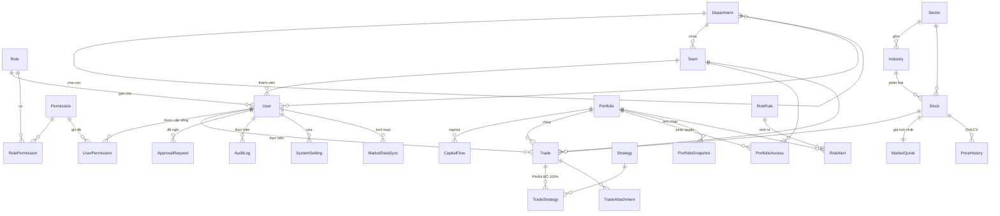

# Mô hình dữ liệu — Phase 01

Tài liệu này giải thích **vì sao** schema có hình dạng như vậy. Bản thân schema
nằm ở [`prisma/schema.prisma`](../prisma/schema.prisma) với chú thích chi tiết
cho từng bảng.

---

## 1. Ba quyết định định hình toàn bộ hệ thống

### 1.1 Tiền tệ là `BigInt`, đơn vị VNĐ nguyên

Không dùng `Float`, không dùng `Decimal`, không dùng `String`.

Lý do không phải là sở thích mà là đặc thù của thị trường Việt Nam: **giá cổ
phiếu luôn là số nguyên đồng**. Bước giá trên HOSE là 10đ (dưới 10.000), 50đ
(10.000–49.950), 100đ (từ 50.000); HNX và UPCOM là 100đ. Phí môi giới và thuế
được làm tròn tới đồng. Vì vậy mọi con số đầu vào của hệ thống đã là số nguyên,
và số nguyên 64-bit cho phép cộng/trừ/nhân **chính xác tuyệt đối**.

| Kiểu | Vấn đề |
|---|---|
| `Float` / `Double` | `0.1 + 0.2 !== 0.3`. Một danh mục nghìn tỷ sẽ lệch dần theo từng giao dịch. Không bao giờ dùng cho tiền. |
| `Decimal` | Đúng về toán học, nhưng Prisma trên SQLite lưu qua kiểu NUMERIC có thể mất chữ số. Cũng chậm hơn và không cần thiết khi đầu vào vốn đã là số nguyên. |
| `BigInt` | Chính xác tuyệt đối. Lưu thành `INTEGER` 64-bit trên SQLite và `BIGINT` trên Postgres — **giống nhau hoàn toàn**, nên việc chuyển database không đổi một con số nào. |

Trần của `BigInt` là 9,22 × 10¹⁸ đồng ≈ 9,2 triệu tỷ đồng. Vốn hoá toàn thị
trường Việt Nam hiện chưa tới 1% con số đó.

**Hệ quả bắt buộc:** `JSON.stringify` không xử lý được `bigint`. Mọi biên giới ra
ngoài (API response, Server Component → Client Component, ghi Audit Log) phải đi
qua [`src/lib/serialize.ts`](../src/lib/serialize.ts). `bigint` được chuyển thành
**string**, không phải number — `number` chỉ an toàn tới 2⁵³ và sẽ sai âm thầm.

### 1.2 Tỷ lệ phần trăm là `Int`, đơn vị basis point

`10000 bps = 100.00%` · `5000 bps = 50.00%` · `336 bps = 3.36%`

Đặc tả §6 yêu cầu tổng phân bổ chiến lược **bằng đúng 100%**. Với số thực,
`50% + 30% + 20%` có thể ra `99.99999999999999%`. Với basis point là phép cộng
số nguyên: `5000 + 3000 + 2000 = 10000`, không có ngoại lệ.

### 1.3 Không có bảng nào lưu P&L

Đặc tả §23: *"Không lưu P&L thủ công. P&L phải được tính từ Transaction + Market
Data."* Schema tuân thủ tuyệt đối:

| Chỉ tiêu | Nguồn tính |
|---|---|
| Current Quantity | Σ (BUY − SELL) từ `trades` có `status = EXECUTED` |
| Average Cost | Σ cost basis ÷ quantity, xử lý tuần tự theo `executedAt` |
| Market Value | quantity × `market_quotes.price` |
| Unrealized P&L | Market Value − Total Cost |
| Realized P&L | Tiền thu về khi bán − giá vốn phần đã bán |
| Portfolio Weight | Market Value của mã ÷ Σ Market Value |
| Available Cash | Σ `capital_flows` (theo dấu) − Σ chi mua + Σ thu bán |
| Sector Exposure | Gộp position theo `stocks.sectorId` |
| Strategy Allocation | Σ `trade_strategies.allocationAmount`, mua cộng bán trừ |

[`scripts/verify-model.ts`](../scripts/verify-model.ts) tính toàn bộ bảng trên từ
dữ liệu thô và in ra, để chứng minh không cần thêm bảng nào.

**Ngoại lệ duy nhất: `portfolio_snapshots`.** Đường hiệu suất lịch sử (§13, các
mốc 1W/1M/3M/6M/YTD/ALL) cần giá trị danh mục tại từng ngày trong quá khứ. Tính
lại đòi hỏi quét toàn bộ `price_history` cho mọi mã ở mọi ngày — quá đắt để làm
mỗi lần mở dashboard. Snapshot là **cache có thể xoá và tính lại**, không phải
nguồn sự thật; điều này được ghi rõ trong chú thích của bảng.

Cần nói rõ một điều mà cách viết trên dễ gây hiểu sai: **bảng này chưa từng được
ghi**, và §23 vẫn được giữ nguyên. `computePerformanceSeries()` dựng lại giá trị
lẫn giá vốn của từng phiên từ `price_history` — đúng phép quét mà đoạn trên gọi
là "quá đắt". Đo thật trên 133 phiên, SQLite cục bộ, trung vị 5 lần chạy sau khi
làm nóng:

```
computePortfolioSummary       5 ms
computePerformanceSeries     19 ms   <- phép quét bị cho là quá đắt
computePerformance            1 ms
computeTeamPerformance       13 ms
computeMemberPerformance     12 ms
                            ─────
cả năm hàm engine            50 ms
```

Vì vậy chuỗi được dựng lại **mỗi lần mở trang** và không cần cache. Toàn bộ phản
hồi HTML ở dev server là ~750 ms, nhưng phần lớn là chi phí biên dịch Turbopack và
serialize RSC — không phải truy vấn.

Con số này sẽ đổi khi `price_history` dài ra: chi phí tăng gần như tuyến tính theo
số phiên × số mã. Mốc cần đo lại là khi chuỗi vượt khoảng một nghìn phiên.

Snapshot vì thế **không** phải điều kiện để có hiệu suất theo khoảng. Nó còn cần
cho một việc khác mà chuỗi dựng lại không làm được: **time-weighted return** có
tính dòng vốn nạp/rút giữa kỳ. Chuỗi dựng lại chỉ đo được biến động giá trên
phần vốn đã ở trong danh mục.

---

## 2. Cấu trúc cốt lõi: Trade có nhiều Strategy

Đây là yêu cầu khó nhất của đặc tả (§6) và là lý do không thể đặt `strategyId`
trực tiếp lên bảng `trades`.

```
BUY MBB  40.000 @ 25.300  =  1.012.000.000 ₫  (+ phí 1.518.000 ₫)

  ┌─ trades ────────────────────────────────┐
  │ code            TXN-2026-000001         │
  │ transactionType BUY                     │
  │ quantity        40.000                  │
  │ price           25.300                  │
  │ fees            1.518.000               │
  │ status          EXECUTED                │
  └────────────────┬────────────────────────┘
                   │ 1 : N
  ┌────────────────▼─── trade_strategies ───────────────────┐
  │ VALUE          5000 bps    506.759.000 ₫               │
  │ SIGNAL         3000 bps    304.055.400 ₫               │
  │ ACCUMULATION   2000 bps    202.703.600 ₫               │
  │                ─────────   ──────────────              │
  │                10000 bps  1.013.518.000 ₫  ← khớp net  │
  └─────────────────────────────────────────────────────────┘
```

### Vì sao lưu cả `allocationAmount` khi nó suy ra được?

Vì **làm tròn**. Chia thẳng rồi làm tròn từng phần cho kết quả sai:

```
182.644.206 ₫ chia 33,34% / 33,33% / 33,33%

Làm tròn từng phần :  60.893.578 + 60.875.313 + 60.875.313 = 182.644.204  ✗ thiếu 2 ₫
Largest remainder  :  60.893.578 + 60.875.314 + 60.875.314 = 182.644.206  ✓ khớp
```

Nếu chỉ lưu tỷ lệ rồi tính lại số tiền ở mỗi lần đọc, dashboard sẽ hiển thị tổng
lệch vài đồng so với giá trị lệnh — và con số lệch sẽ khác nhau tuỳ cách gộp.
Do đó số tiền được **chốt cứng một lần lúc ghi** bằng thuật toán
[`allocateAmount()`](../src/lib/money.ts) (largest remainder / Hare quota), bảo
đảm `Σ allocationAmount = netAmount` tuyệt đối.

### Ràng buộc `Σ allocationBps = 10000` được cưỡng chế ở đâu?

Không có cơ sở dữ liệu quan hệ nào biểu diễn được ràng buộc "tổng các dòng con
bằng một hằng số" bằng `CHECK`. Vì vậy nó được bảo vệ ở ba lớp:

1. **Biên vào** — [`tradeSchema`](../src/domain/validation.ts) từ chối dữ liệu có
   tổng khác 100%, có chiến lược trùng, hoặc thiếu phân bổ.
2. **Lúc ghi** — `buildTradeStrategyRows()` là con đường duy nhất tạo dòng
   `trade_strategies`; nó gọi `allocateAmount()` (hàm này tự ném lỗi nếu tổng
   khác 10000) và ghi cùng `Trade` trong một transaction.
3. **Hậu kiểm** — Phần A của `verify:model` quét lại toàn bộ database và thoát
   với mã lỗi 1 nếu phát hiện bất kỳ dòng nào lệch. Dùng được trong CI.

### Vì sao dùng số tiền **thực tế** (net) chứ không phải giá trị danh nghĩa?

`netAmount` = `quantity × price ± fees ± tax`. Đây là dòng tiền thật ra/vào tài
khoản. Phân bổ theo con số này thì tổng vốn theo chiến lược khớp chính xác với
tổng tiền đã chi — Phần E của `verify:model` kiểm tra chính điều đó.

### Không đếm trùng vốn

Khi một Trade thuộc ba chiến lược, tổng vốn theo chiến lược phải bằng vốn của
Trade, không phải ba lần. Điều này được bảo đảm về mặt cấu trúc: mỗi dòng
`trade_strategies` giữ **một phần** của số tiền, và các phần cộng lại đúng bằng
tổng. Lệnh bán được trừ đi (`BUY` cộng, `SELL` trừ) để ra vốn ròng đang triển
khai.

---

## 3. Strategy thuộc Trade, không thuộc User

Đặc tả §4 nói rõ: luồng duyệt tài khoản **không có** bước "Assign Strategy cho
User", vì một người có thể thực hiện giao dịch thuộc nhiều chiến lược.

Schema cưỡng chế điều này bằng cách **không tồn tại cột nào** nối `users` với
`strategies`. Đường duy nhất từ người dùng tới chiến lược là:

```
users → trades → trade_strategies → strategies
```

Nghĩa là câu hỏi "chiến lược của anh A là gì" không có câu trả lời trong hệ
thống, còn câu hỏi "anh A đã triển khai bao nhiêu vốn theo chiến lược Value"
thì có. Đó chính là điều đặc tả muốn.

---

## 4. Sơ đồ quan hệ



---

## 5. Mười một khối bảng

| # | Khối | Bảng | Phục vụ mục nào của đặc tả |
|---|---|---|---|
| 1 | RBAC | `roles`, `permissions`, `role_permissions`, `user_permissions` | §3 Role & Permission |
| 2 | Tổ chức | `departments`, `teams`, `users` | §2 Cấu trúc tổ chức, §4 Registration flow |
| 3 | Master thị trường | `sectors`, `industries`, `stocks` | §7 Stock Master, §15 Sector Exposure |
| 4 | Vốn & danh mục | `portfolios`, `portfolio_accesses`, `capital_flows` | §12 KPI, §14 Capital Allocation |
| 5 | Strategy & Trade | `strategies`, `trades`, `trade_strategies`, `trade_attachments` | §5, §6, §8 |
| 6 | Dữ liệu thị trường | `market_quotes`, `price_history`, `market_index_history`, `market_data_syncs` | §10 VNStock |
| 7 | Hiệu suất | `portfolio_snapshots` | §13 Portfolio Performance |
| 8 | Rủi ro | `risk_rules`, `risk_alerts`, `risk_scan_runs` | §19 Risk & Alerts |
| 9 | Duyệt | `approval_requests` | §21 menu Approvals |
| 10 | Audit | `audit_logs` | §20 Audit Log |
| 11 | Cấu hình | `system_settings` | §21 menu Settings |

---

## 5b. Nhóm ≠ Vai trò ≠ Chiến lược

Ba trục độc lập, và mô hình cố tình không nối chúng lại:

```
Department ──< Team ──< User
                         │
                         │  users KHÔNG có đường nối tới strategies (§4)
                         │
                         └──< Trade ──< TradeStrategy >── Strategy
```

- `users.teamId` → **làm việc với ai**. Đá Bóng, Cầu Lông, Tài chính, Cá nhân.
- `users.roleId` → **được làm gì**. Quyền suy từ `role_permissions` cộng override
  trong `user_permissions`.
- `trade_strategies` → **đang làm gì**. Chiến lược của một người là kết quả quan
  sát từ giao dịch của họ, không phải một cột trên `users`.

Điểm thứ ba là ràng buộc cấu trúc, không phải quy ước: **không tồn tại đường đi
nào từ `users` tới `strategies`** trong schema. Nhờ vậy §4 "người dùng không bị
gán chiến lược cố định" không thể bị vi phạm kể cả khi có người muốn.

Bài học đã trả giá: ba team đầu tiên được đặt tên theo vai trò, nên trang Members
in cùng một chữ ở cột Vai trò và cột Nhóm — người đọc kết luận rằng đổi nhóm là
đổi quyền. Tên của một chiều dữ liệu phải cho biết nó là chiều nào.

---

## 6. Audit Log bất biến

Đặc tả §23: *"Không cho sửa giao dịch không để lại lịch sử."*

Bảng `audit_logs` được thiết kế **chỉ ghi thêm**:

- Không có cột `updatedAt` — không có khái niệm "sửa một bản ghi audit".
- Lưu kèm `actorEmail` / `actorName` / `actorRole` dưới dạng **bản chụp**, để log
  vẫn đọc được nguyên nghĩa sau khi người dùng bị xoá hoặc đổi vai trò.
- `beforeJson` / `afterJson` / `changedFieldsJson` ghi đủ Who–When–What–Before–After.

Trên SQLite tính bất biến là quy ước ở tầng ứng dụng. Khi chuyển sang Postgres
sẽ được khoá ở tầng database bằng `REVOKE UPDATE, DELETE` —
xem [POSTGRES-MIGRATION.md](./POSTGRES-MIGRATION.md).

Optimistic locking trên `trades.version` chống trường hợp hai người sửa cùng lúc:
người ghi sau sẽ bị từ chối thay vì âm thầm ghi đè mất thay đổi của người trước.

---

## 7. Trạng thái giao dịch và ảnh hưởng tới P&L

**Chỉ `EXECUTED` được tính vào tiền, vị thế và P&L.** Nháp, chờ duyệt, bị từ
chối, đã huỷ đều không. Tiền chỉ ra/vào tài khoản khi lệnh khớp thật, và một dòng
`trades` ghi lại một lần khớp **đã** xảy ra.

### Luồng THẬT, không phải luồng trên sơ đồ cũ

```
DRAFT ──► PENDING_APPROVAL ──────────────► EXECUTED ──► CANCELLED
  │              │            (một nhịp)       ▲
  │              ├──► REJECTED                 │
  │              │                            │
  │              └──► APPROVED ────────────────┘   ◄── KHÔNG TỚI ĐƯỢC
  └──────────────────────────────────────────────► CANCELLED
```

`approveTradeAction` chuyển thẳng `PENDING_APPROVAL → EXECUTED` **một nhịp**.
Trạng thái `APPROVED` hiện **không tới được**: `createTradeAction` ghim cứng
`status: DRAFT` và bỏ qua giá trị từ form, và không action nào đặt `APPROVED`. Đã
kiểm trên dữ liệu: 0 dòng.

Sơ đồ trước đây vẽ `PENDING_APPROVAL → APPROVED → EXECUTED` như luồng chính. Đó là
luồng chưa từng chạy, và vẽ nó ra làm người đọc tin rằng một lệnh phải đi qua
`APPROVED`.

### Cái bẫy `APPROVED`

Nhãn tiếng Việt của nó là **"Đã duyệt"**, nhưng nó **không** nằm trong
`TRADE_STATUSES_COUNTED_IN_POSITION`. Một lệnh ở trạng thái này sẽ đọc như đã được
duyệt xong mà không xuất hiện trong tiền, vị thế, P&L, chia theo nhóm hay theo cá
nhân — nó biến mất khỏi mọi con số.

Nếu sau này mở luồng hai nhịp (duyệt rồi mới ghi nhận khớp) thì phải quyết dứt
khoát: **hoặc** thêm `APPROVED` vào danh sách được tính, **hoặc** đổi nhãn của nó
thành thứ không đọc thành "đã xong".

### Hằng số này giờ mới thật sự là nguồn sự thật

Đoạn trên đây từng viết rằng quy tắc được khai báo ở
[`TRADE_STATUSES_COUNTED_IN_POSITION`](../src/lib/enums.ts) "để Portfolio Engine
không thể quên". **Câu đó sai.** Hằng số tồn tại nhưng **không được dùng ở đâu cả**
— quy tắc bị ghim cứng thành `status: TRADE_STATUS.EXECUTED` ở mười chỗ rải rác:
năm truy vấn trong `portfolio-engine.ts`, cộng các trang Strategies, Teams, chi
tiết cá nhân, form tạo lệnh, và `reports/build.ts`.

Hậu quả: sửa hằng số **không đổi gì cả** mà vẫn trông như đã đổi. Đúng kiểu sai đã
làm nút "Duyệt & ghi nhận khớp" chết từ ngày viết ra — hai chỗ trong cùng codebase
nói ngược nhau.

Nay `enums.ts` xuất ra ba dạng của cùng một quy tắc, và mọi nơi đọc từ đó:

| Dạng | Dùng khi |
|---|---|
| `TRADE_STATUSES_COUNTED_IN_POSITION` | cần chính danh sách |
| `COUNTED_TRADE_STATUS` | điều kiện `where.status` của Prisma |
| `countsInPosition(status)` | lọc trên mảng đã tải về |

Đã chứng minh lan truyền: đổi tạm hằng số sang `DRAFT` (0 dòng) thì vị thế về 0 mã,
số dư tiền thành 10 596 tr (chỉ còn dòng vốn, không trừ lệnh mua nào), danh sách cá
nhân về 0 người; hoàn nguyên thì mọi con số trở lại y nguyên.

Bản đồ chuyển trạng thái hợp lệ nằm ở `TRADE_STATUS_TRANSITIONS`, dùng để chặn
việc "sửa lụi" trạng thái ở Phase 04.

### Điều quy tắc này KHÔNG làm

Lệnh `BUY` đang `PENDING_APPROVAL` **không** bị trừ khỏi `Available Cash`. Đây là
quyết định nghiệp vụ đã được xác nhận: *lệnh được duyệt mới tính vào.* Hệ quả cần
biết: phần tiền của một lệnh mua chờ duyệt vẫn nằm trong "khả dụng", nên con số đó
lạc quan hơn số thật sự còn triển khai được.

---

## 8. Vì sao `String` thay cho `enum` và `Json`

Prisma trên SQLite **không hỗ trợ** `enum`, `Json`, hay scalar list. Cách xử lý:

| Nhu cầu | Trên SQLite | Trên Postgres (sau này) |
|---|---|---|
| enum | `String` + hằng số trong [`src/lib/enums.ts`](../src/lib/enums.ts) | `enum` thật, sinh từ chính danh sách đó |
| JSON | `String` chứa JSON text, tên field kết thúc bằng `Json` | `Jsonb` |

Điều quan trọng: **nguồn sự thật của các giá trị hợp lệ là `src/lib/enums.ts`,
không phải database.** Nhờ đó việc chuyển sang Postgres chỉ đổi kiểu cột, không
đổi một dòng code nghiệp vụ nào.

---

## 9. Master data là code, database chỉ là bản sao

`src/data/master-data.ts` và `src/domain/permissions.ts` chứa toàn bộ master
data. `prisma/seed.ts` dùng `upsert` theo khoá tự nhiên (`code` / `symbol` /
`key`) nên chạy lại bao nhiêu lần cũng an toàn.

Hai điểm cần lưu ý về hành vi của seed:

- **Ma trận Role → Permission bị ghi lại hoàn toàn** mỗi lần seed. Nếu một quyền
  bị bỏ khỏi `ROLE_PERMISSIONS` thì nó cũng phải mất trong database — nếu không,
  quyền "mồ côi" sẽ tồn tại mãi mà không ai biết.
- **`system_settings.value` KHÔNG bị ghi đè.** Cấu hình mà người dùng đã sửa
  trong app phải được giữ lại; seed chỉ cập nhật phần tên và mô tả.

Danh sách mã chứng khoán là **bộ khởi đầu** (84 mã: VN30 và đại diện từng ngành),
không phải toàn bộ thị trường. Phase 07 sẽ đồng bộ đầy đủ từ VNStock qua
`MarketDataSync.kind = 'STOCK_MASTER'` và cập nhật lại tên công ty theo dữ liệu
chính thức.

---

## 10. Những gì Phase 01 cố tình chưa làm

| Chưa có | Thuộc phase |
|---|---|
| Bảng session / refresh token, hash mật khẩu khi đăng nhập | 02 |
| API và UI quản lý mã chứng khoán | 03 |
| Form nhập giao dịch, chuyển trạng thái, luồng duyệt | 04–05 |
| Portfolio Engine thực thụ (có cache, phân trang, đa danh mục) | 06 |
| Market Data Service bằng Python gọi `vnstock` | 07 |
| Dashboard, biểu đồ, drill-down | 08 |
| Risk Engine tự động quét và bắn `risk_alerts` | 09 |
| Xuất báo cáo, xem Audit Log trên UI | 10 |

Hai bảng được thêm ở Phase 09, sau khi engine thật đi vào chạy:

- `risk_alerts.targetRef` — đối tượng bị cảnh báo (symbol, mã ngành, mã chiến
  lược). Không có cột này thì khoá chống trùng chỉ còn `ruleId`, và một rule
  "mã vượt 10%" bắn cho năm mã sẽ bị coi là một cảnh báo duy nhất.
- `risk_scan_runs` — nhật ký từng lượt quét. Cần thiết vì một danh sách cảnh
  báo trống có hai nghĩa hoàn toàn khác nhau: không có gì vượt ngưỡng, hoặc
  không ai đo cả.

Chi tiết trong [RISK-ENGINE.md](RISK-ENGINE.md).

`scripts/verify-model.ts` có tính toán position và P&L, nhưng đó là **bằng chứng
mô hình đủ dữ liệu**, không phải Portfolio Engine. Engine thật ở Phase 06 sẽ cần
xử lý cache, nhiều danh mục, phân trang, và các trường hợp biên như chia cổ tức
bằng cổ phiếu hay cổ phiếu thưởng.

## 11. Tài khoản chứng khoán của thành viên

Thành viên khai các tài khoản mình đang nắm, và ghi nhận vốn đã nạp vào từng tài
khoản. Bốn thông tin: **sàn**, **số tài khoản**, **dưới IB nào**, **tiền được nạp**.

"Dưới IB nào" KHÔNG phải ô tự gõ mà là một khoá ngoại `ibId` trỏ vào bảng
`introducing_brokers` — danh mục do quản trị khai. Ô tự gõ đẻ ra "Bùi Hải", "bùi hải"
và "Bui Hai" cùng lúc, và trên Dashboard một IB tách thành ba dòng mỗi dòng một phần
vốn. Để trống vẫn hợp lệ và có nghĩa: mở trực tiếp, không qua IB.

### Tiền nạp KHÔNG là một cột của `broker_accounts`

Đây là quyết định quan trọng nhất của khối này. Mỗi lần nạp là **một dòng**
`capital_flows` trỏ về tài khoản qua `brokerAccountId` — cùng bảng mà
`computeCash()` đọc để tính số dư tiền.

Nếu `broker_accounts` có thêm cột `depositedAmount` thì "tổng đã nạp" tồn tại ở hai
nơi, và hai nơi đó sẽ lệch nhau — chỉ là vấn đề thời gian. Tổng nạp của một tài
khoản luôn là **phép cộng** trên `capital_flows`, cộng **theo dấu** của `flowType`
(`CAPITAL_FLOW_SIGN`), nên một lần rút trừ đi chứ không cộng thêm.

Hệ quả có thật, và người dùng đã chọn nó: **nạp vốn làm tăng số dư tiền của cả danh
mục.** Đo được: nạp ₫500 triệu → Available Cash ₫1,752 tỷ → ₫2,252 tỷ, Portfolio
Value ₫10,33 tỷ → ₫10,83 tỷ. Rút lại ₫500 triệu → cả hai về đúng số cũ.

### Nhóm gắn tại thời điểm nạp

Dòng vốn nhận `teamId` của người nạp **lúc nạp**, không suy ra lúc đọc. Hai lý do:

1. `computeCash()` không phải join `broker_accounts → users → teams`.
2. Người chuyển nhóm sau đó thì khoản vốn cũ vẫn thuộc nhóm cũ — cùng nguyên tắc
   với `trades.teamId`: lịch sử không đổi theo hiện tại.

### `@@unique([broker, accountNo])` là chốt chống đếm trùng vốn

Hai người cùng khai một tài khoản thì tiền nạp vào nó được cộng **hai lần** vào tiền
của danh mục. Ràng buộc này chặn ở database; action còn kiểm trước để trả câu tiếng
Việt thay vì để Prisma ném lỗi.

### Không xoá tài khoản, chỉ đóng

`isActive = false`. Xoá sẽ làm mồ côi các dòng `capital_flows` trỏ về nó (khoá ngoại
`SET NULL`) — lúc đó tiền vẫn nằm trong danh mục nhưng không còn biết nó ở đâu.

### Có cả RÚT vốn, dù người dùng chỉ yêu cầu phần nạp

Không có đường rút thì **một lần gõ sai số sẽ vĩnh viễn thổi phồng tiền của danh
mục**, và cách sửa duy nhất là vào database. Rút vốn là bút toán đối ứng đúng nghĩa,
không phải xoá dữ liệu.

### Quyền: chỉ chính chủ, không qua duyệt

Theo lựa chọn nghiệp vụ của người dùng. Chốt **không** dựa vào mã quyền mà dựa vào
danh tính: `account.userId === actor.id`. Quản trị cũng không sửa được tài khoản của
người khác qua đường này.

Đã kiểm bằng cách sửa `brokerAccountId` trong form sang tài khoản của người khác rồi
gửi: **0 dòng** được ghi. Form ẩn đi với người không phải chủ chỉ là lớp giao diện —
chốt thật nằm trong server action.

**Hệ quả cần biết:** không có ai soát lại số vốn một thành viên tự khai. Nhật ký
kiểm toán là chốt duy nhất, nên mọi thao tác ở đây đều ghi audit
(`ENTITY_TYPE.BROKER_ACCOUNT` và `ENTITY_TYPE.CAPITAL_FLOW`). Muốn siết thì bật luồng
hai mắt — bảng đã có sẵn `status`/`approvedById`/`approvedAt`.

### Sàn là master data dạng code

`BROKER` trong `src/lib/enums.ts`, cùng lý do như `STOCK_SEED` (§9): danh sách công
ty chứng khoán ở Việt Nam là hữu hạn và đổi rất chậm. Để nó thành bảng sửa qua giao
diện thì sớm muộn sẽ có cả `SSI`, `ssi` và `SSI ` trong dữ liệu, mỗi cái thành một
sàn riêng khi gộp số.

`OTHER` tồn tại vì danh sách không thể đủ; khi chọn nó thì `brokerOther` **bắt buộc**
phải điền (cưỡng chế bằng `.refine()` trong `brokerAccountSchema`).

### Thẻ này ở CẢ HAI trang, một bản cài đặt

Ban đầu thẻ chỉ nằm inline trong `/members/[id]`, và hậu quả là **không ai tìm ra**:
muốn khai tài khoản của chính mình thì phải vào Members → tự tìm tên mình trong danh
sách → bấm vào, trong khi `/profile` ("Tài khoản của tôi") — chỗ tự nhiên nhất — lại
không có gì.

Nay là `src/components/BrokerAccountsCard.tsx`, dùng ở:

| Trang | `isSelf` | Có form? |
|---|---|---|
| `/profile` | luôn true | có |
| `/members/[id]` của chính mình | true | có |
| `/members/[id]` của người khác | false | không, chỉ đọc |

Component **tự truy vấn** thay vì nhận dữ liệu từ trang: nơi gọi không phải biết cần
select cột nào, và tổng "vốn ròng đã nạp" chỉ được tính ở một chỗ. Dán hai lần thì
sớm muộn hai chỗ sẽ khác nhau.

### Trạng thái rỗng phải nói ra HAI BƯỚC

Nút "Nạp vốn" nằm trên **dòng của một tài khoản**, nên khi chưa có tài khoản nào thì
nó chưa tồn tại — và người dùng đi tìm nó. Bản đầu chỉ có một dòng chữ mờ, không đủ:
câu hỏi đầu tiên nhận được là *"ô nạp và rút tiền ở mục nào để nhập"*.

Nay trạng thái rỗng ghi rõ hai bước, và cột chứa nút có tiêu đề **"Nạp / rút tiền"**
thay vì để trống.

### Form khai tài khoản KHÔNG có ô "tiền được nạp"

Có chủ đích. Nạp tiền làm tăng tiền của cả danh mục, nên nó là một việc riêng với
một nút riêng và một dòng nhật ký riêng. Nhét nó vào form khai tài khoản khiến một
hành động đổi số tiền trông như một ô thông tin.

## 12. Lệnh phải gắn tài khoản, và khai số dư đầu kỳ

### `trades.brokerAccountId` — bắt buộc với lệnh mới

Không có tài khoản thì không có chỗ để tiền ra/vào, và số dư từng tài khoản không
dựng được. Trang `/transactions/new` **chặn hẳn** khi người nhập chưa có tài khoản
nào đang mở, kèm ba bước phải làm.

Cột ở database là **nullable** — 15 lệnh có trước cột này không mang thông tin đó, và
gán bừa một tài khoản cho chúng là bịa dữ liệu. Ràng buộc "bắt buộc" nằm ở
`tradeSchema` và `createTradeAction`, nơi chỉ lệnh MỚI đi qua. Trang chi tiết lệnh
hiện `—` cho lệnh cũ, kèm tooltip nói rõ vì sao.

**Một lỗi suýt lọt:** ban đầu tôi thêm `brokerAccountId` vào schema và validation
nhưng **quên đưa vào `tx.trade.create()`**. TypeScript không bắt được vì cột là
optional ở tầng Prisma — form sẽ bắt buộc chọn tài khoản, người dùng chọn, và giá trị
đó rơi vào hư không. Chỉ lộ ra khi ghi thử một lệnh thật rồi đọc lại từ database.

### Ba chốt, ở ba chỗ khác nhau

| Chốt | Ở đâu | Chặn gì |
|---|---|---|
| Có tài khoản đang mở | trang `/transactions/new` | nói rõ phải làm gì, không phải bảo mật |
| Tài khoản là của chính mình | `createTradeAction` | sửa id trong form ẩn để ghi lệnh trừ tiền người khác |
| Tài khoản đang mở | `createTradeAction` | ghi lệnh qua tài khoản đã đóng |

Đã kiểm chốt thứ ba bằng cách đóng tài khoản sau khi form đã tải rồi mới gửi: **0
lệnh** được ghi.

### Thiếu tiền thì CẢNH BÁO, không chặn

Form hiện số dư tài khoản và "sau lệnh còn bao nhiêu", tô đỏ khi âm. Nhưng vẫn cho
ghi, vì **một dòng `trades` ghi lại một lần khớp ĐÃ xảy ra**. Chặn ghi vì con số của
hệ thống nói không đủ nghĩa là không ghi được một việc có thật — và tiền có thể thiếu
chỉ vì vốn nạp chưa được khai, hoặc vì lệnh dùng ký quỹ.

Cùng nguyên tắc đã dùng cho `PENDING_APPROVAL → EXECUTED` một nhịp: hệ thống ghi nhận
quá khứ, không phán xét nó.

### Khai số dư đầu kỳ

Tài khoản đã dùng từ trước khi vào hệ thống thì khai luôn lúc thêm tài khoản: **mã,
khối lượng, giá vốn, ngày mua** cho từng vị thế, cộng **tiền mặt còn lại**.

#### Vị thế có sẵn được ghi thành LỆNH MUA

Không có bảng "vị thế ban đầu" riêng. Đó là cách duy nhất để chúng chảy vào mọi con
số: vị thế, giá vốn bình quân, lãi/lỗ, tỷ trọng ngành, phân bổ chiến lược, hiệu suất
theo phiên. Một bảng riêng sẽ phải được cộng thêm ở từng chỗ, và chỗ nào quên cộng thì
im lặng sai.

Lệnh ghi thẳng `EXECUTED`, không qua duyệt: chúng đã khớp từ trước khi hệ thống tồn
tại. Bắt chúng chờ duyệt là bắt duyệt lại quá khứ.

#### Giá vốn là BẮT BUỘC, dù người dùng không nhắc tới

Yêu cầu ban đầu là "mã sản phẩm, khối lượng, thời gian mua, tiền mặt còn" — không có
giá. Nhưng không có giá vốn thì không có lãi/lỗ: `unrealizedPnl = giá trị thị trường −
giá vốn`, và toàn bộ engine đứng trên phép trừ đó. Lấy giá hiện tại làm giá vốn sẽ cho
mọi vị thế cũ lãi/lỗ đúng bằng 0 — một con số trông bình thường nhưng sai.

#### Vốn ghi nhận = Σ giá vốn + tiền mặt còn

Đây là chỗ dễ sai nhất. Người khai nhập "tiền mặt còn", nhưng con số vào hệ thống phải
là **giá vốn các vị thế cộng tiền mặt**:

```
vốn đưa vào tài khoản  =  Σ (khối lượng × giá vốn)  +  tiền mặt còn
số dư sau đó           =  vốn đưa vào − Σ giá vốn   =  tiền mặt còn   ✓
```

Vì các vị thế được ghi thành lệnh MUA, và lệnh mua **trừ tiền** của tài khoản. Nếu chỉ
ghi nhận đúng phần tiền mặt còn thì số dư tài khoản sẽ âm đúng bằng giá vốn.

Form hiện phép cộng đó **trước khi bấm lưu** — người khai cần thấy con số làm tăng
tiền của cả danh mục, không phải phát hiện ra sau trên Dashboard.

Đã kiểm end-to-end: khai TCBS OPEN12345 với MBB 1.000×25.000 và VHM 500×60.000, tiền
mặt còn 40 triệu →

```
nạp 95,000 tr   chi mua 55,000 tr   còn lại 40,000 tr   2 lệnh
```

và MBB trong hệ thống chung tăng từ 52.000 lên 53.000 cổ, VHM từ 20.000 lên 20.500.

#### Chiến lược chọn một lần cho cả lô

Vị thế cũ thường không nhớ mua theo phương pháp nào, và bắt điền từng dòng chỉ khiến
người ta chọn bừa. Một ô chọn cho cả lô, sửa lại từng lệnh sau nếu cần — §6 cho phép
một lệnh chia cho nhiều chiến lược.

#### Phí và thuế bằng 0

Người khai chỉ biết **giá vốn** — con số đó đã gồm phí rồi. Cộng thêm một khoản phí
ước lượng sẽ làm giá vốn cao hơn thực tế và lãi/lỗ thấp hơn thực tế.

#### Tất cả trong MỘT transaction

Tài khoản, N lệnh, và dòng vốn ghi cùng một lúc. Nửa chừng thất bại sẽ để lại một tài
khoản có vị thế mà không có vốn — số dư âm, và không ai biết vì sao.

Mã lệnh sinh bằng cách đọc số thứ tự lớn nhất **một lần trước transaction** rồi tự
tăng. Gọi `nextTradeCode()` N lần trong một transaction sẽ trả về **cùng một mã N
lần**, vì những dòng vừa ghi chưa commit nên chính nó không thấy.

#### Mã chứng khoán phải có trong master data

§23. Không tự tạo mã mới khi khai — một mã gõ sai sẽ thành một "công ty" không có
ngành, không có giá, và nó sẽ nằm lại trong mọi báo cáo. Action báo rõ mã nào không có.

## 13. Kiểm công thức: ba lệnh, ba câu hỏi khác nhau

```bash
npm run verify:model      # mô hình dữ liệu có đủ để tính ra mọi con số không?
npm run audit:formulas    # các hàm engine có tính đúng không?
npm run audit:pages       # các trang tự cộng lấy có khớp engine không?
```

Ba file hỏi ba câu khác nhau và **không được gộp**. Gộp lại thì phép kiểm sẽ so
engine với chính engine — chỉ chứng minh nó nhất quán với bản thân, không chứng minh
nó đúng.

### `audit:formulas` — 66 phép kiểm, mỗi phép so HAI ĐƯỜNG

Nguyên tắc: tính lại từ `trades` / `capital_flows` / `market_quotes` theo một đường
khác rồi so từng đồng với engine.

| Phần | Kiểm gì |
|---|---|
| A | `netAmount`, `costBasis`, `ratioToBps` đúng định nghĩa; chia cho 0 trả 0 |
| B | Khối lượng = Σ mua − Σ bán; `marketValue` = KL × giá; lãi/lỗ = TT − vốn |
| C | Tiền = góp + khác − mua + bán; available = số dư − dự phòng |
| D | `portfolioValue` = vị thế + **số dư** tiền; Invested+Cash+Reserve = 100% |
| E | Σ ngành = tổng vị thế; Σ `allocationBps` = 100%; Σ `allocationAmount` = tiền thật |
| F | Σ theo nhóm = tổng (6 đại lượng) + Σ tiền các nhóm = tiền danh mục |
| G | Σ theo cá nhân = tổng; `returnBps` null ⟺ chưa có giá vốn |
| H | Σ theo tài khoản + phần chưa gắn = tổng |
| I | Chuỗi chuẩn hoá về 100; hai vế Alpha cùng gốc cùng đích; đổi theo khoảng |
| J | `applyScope`: SCOPED ghi đè, NONE và không-nhóm ra sentinel, sentinel không rò rỉ |
| K | Lọc theo chiến lược: Σ mọi lát = tổng, sai số ≤ 1đ mỗi lát làm tròn |
| L | `allocateAmount` không mất đồng nào, kể cả với số âm |
| M | Cảnh báo rủi ro thật sự vi phạm ngưỡng của nó |

### Lỗi tìm được: `verify-model.ts` có công thức Alpha RIÊNG, và nó sai

```
verify-model (cũ)   Alpha −20,70%
ứng dụng            Alpha  +6,29%
```

Cùng một danh mục, hai con số, và bản sai lại là bản mang tên *"verify"*.

Nó lấy `totalPnl / totalCost` — một tỷ số **không có mốc thời gian** — trừ đi mức tăng
VN-Index trên **toàn bộ** lịch sử chỉ số (~264 phiên), phần lớn là thời gian danh mục
còn chưa mở lệnh nào. Đúng cái lỗi lệch khoảng đã sửa trong `computePerformance`, chỉ
là nó sống ở một file khác nên không được sửa theo.

Cái làm nó sống sót lâu như vậy:

```ts
check(true, 'Alpha tính được từ PortfolioSnapshot/MarketIndexHistory');
```

Một dòng **luôn xanh**. Nó không kiểm gì cả, mà lại đứng ngay dưới ba con số sai nên
đọc như thể đã kiểm chúng. Nay thay bằng 5 phép kiểm thật: hai vế cùng gốc, cùng đích,
`comparable`, và con số phải **đổi theo khoảng**.

> Một phép kiểm luôn đúng còn tệ hơn không có phép kiểm nào: nó tạo cảm giác đã kiểm.

### `tsconfig.scripts.json`

Engine mở đầu bằng `import 'server-only'` — chỉ giải được trong build của Next, chạy
thẳng bằng `tsx` sẽ báo *Cannot find module*. File này trỏ tên gói đó vào module rỗng
mà chính Next dùng cho phía server, nên script gọi được engine mà **không** phải nới
lỏng chốt an toàn trong `tsconfig.json` của ứng dụng.

Nhờ vậy `verify-model` bỏ được công thức Alpha riêng và dùng chung với ứng dụng — một
nguồn sự thật.

### `audit:pages` — 3 mục "cần xem lại" là TRẠNG THÁI DỮ LIỆU, không phải lỗi code

| Mục | Ý nghĩa |
|---|---|
| 15 lệnh chưa gắn tài khoản | Lệnh có trước `trades.brokerAccountId`. Σ số dư tài khoản chưa bằng tiền danh mục — chênh đúng bằng phần chưa gắn. |
| 6 dòng vốn ở quỹ chung | Chưa cấp vốn riêng cho nhóm nào. "Tiền của nhóm" hiện "—". |
| 0 ảnh chụp cuối ngày | Hiệu suất đang dựng lại từ `price_history`, chưa phải time-weighted return có tính dòng vốn. |

Ba mục này **có chủ đích** và đã ghi trong README. Chúng ở lại danh sách kiểm để không
ai quên — chứ không phải để báo động.

### "Trễ 1338 phút" — cảnh báo đúng công thức nhưng sai câu hỏi

Chiều thứ Bảy 29/08, Dashboard báo giá trễ 1338 phút. Kiểm ra: giá đang lưu là **phiên
thứ Sáu 28/08** — tức là **giá mới nhất tồn tại**. Thị trường đóng cửa, không có gì để
lấy thêm cho tới thứ Hai.

Quy tắc cũ:

```ts
connected = ageMinutes <= staleAfterMinutes   // 120 phút
```

Nó đo *bao nhiêu phút kể từ lần lấy giá cuối*. Với một hệ thống dùng **giá đóng cửa**,
đó là câu hỏi sai. Câu đúng là: *giá đang lưu có phải của phiên gần nhất đã đóng không?*

Hậu quả của câu hỏi sai: cảnh báo bật **mỗi đêm và trọn hai ngày cuối tuần** — khoảng
120 giờ mỗi tuần trên 168. Một cảnh báo bật gần như suốt không còn là cảnh báo: người
dùng học cách bỏ qua nó, và đến lúc dữ liệu hỏng thật thì không ai nhìn.

#### Hai thước đo cho hai hoàn cảnh

| Khi nào | Thước đo | Vì sao |
|---|---|---|
| **Trong phiên** (T2–T6, 9h–15h) | phút, ngưỡng `stale_after_minutes` | giá phải nhảy liên tục; đứng im 2 tiếng là hỏng |
| **Ngoài phiên** | số **phiên** chậm | thời gian trôi qua không nói lên điều gì |

`MarketDataStatus` trả thêm `duringSession`, `quoteTradingDate`, `expectedSession`,
`sessionsBehind`.

#### `lastClosedSession()`

```
thứ Bảy, Chủ nhật      → lùi về thứ Sáu
ngày thường, đã đóng   → chính hôm nay
ngày thường, chưa đóng → lùi về ngày làm việc trước
```

Đã kiểm ở sáu mốc:

```
thời điểm                          trong phiên   phiên gần nhất đã đóng
Thứ Bảy 21:25 giờ VN               false         2026-08-28
Chủ nhật 12:00                     false         2026-08-28
Thứ Sáu 11:00 (đang trong phiên)   true          2026-08-27
Thứ Sáu 16:00 (sau đóng cửa)       false         2026-08-28
Thứ Hai 08:30 (trước giờ mở)       false         2026-08-28
Thứ Hai 11:00 (đang trong phiên)   true          2026-08-28
```

#### KHÔNG biết ngày lễ

Hệ thống chưa có lịch nghỉ lễ HOSE, nên hôm sau một ngày lễ sẽ thấy "chậm 1 phiên"
trong đúng một ngày rồi tự hết.

Chấp nhận có chủ đích: cái giá của việc không có lịch lễ là **một cảnh báo thừa mỗi vài
tháng**; cái giá của quy tắc cũ là **một cảnh báo thừa mỗi đêm và trọn mỗi cuối tuần**.

#### Trước và sau

| | Trước | Sau |
|---|---|---|
| Chip trên thanh | `Market Data trễ 1338 phút` (vàng) | `Giá phiên 28/08` (xanh) |
| Trang Market Data | `1348 phút trước · ngưỡng trễ 120 phút` | `ngoài phiên nên đo theo phiên giao dịch, không theo phút` |
| Thẻ mới | — | `Phiên giao dịch · 28/8/2026 · phiên gần nhất đã đóng · đang mới nhất` |

Số phút vẫn hiện trên trang Market Data — nó vẫn là thông tin, chỉ không còn là **căn
cứ để báo động** khi ngoài phiên.
